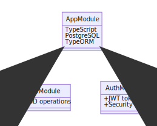

# A Sample NestJs Application

<p style="text-align: center;">

</p>

## Installation

```bash
$ yarn install
```

## Running the app

```bash
# development
$ yarn run start

# watch mode
$ yarn run start:dev

# production mode
$ yarn run start:prod
```

## Test

```bash
# unit tests
$ yarn run test

# e2e tests
$ yarn run test:e2e

# test coverage
$ yarn run test:cov
```

## Important Nest Commands

```bash
# Module creation
$ nest g module <module-name>

# Controller creation
$ nest g controller <module-name> --no-spec

# Service creation
$ nest g service tasks --no-spec
```

## External Packages Installed

```bash
# id generator
$ yarn add uuid

# validation and transformation
$ yarn add class-validator class-transformer
```
